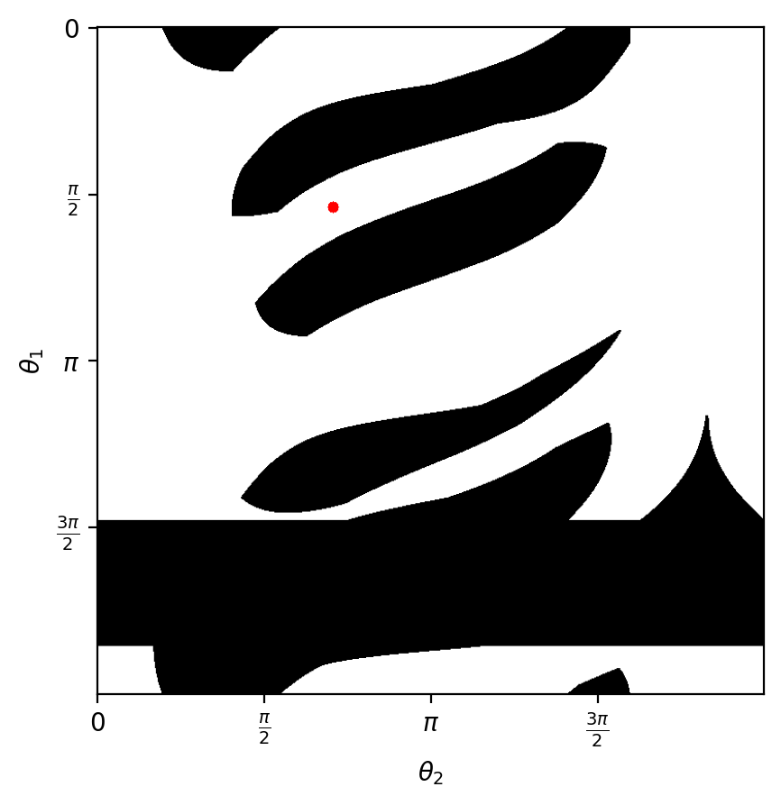

# Neural Potential Field

Neural Potential Field is an Instance of Artificial Potential Field.

## Introduction

Planning in configuration space allows us to consider the robot as a single point, thus simplifying the planning problem.

|                          workspace                           |                     configuration space                      |
| :----------------------------------------------------------: | :----------------------------------------------------------: |
|  |  |

|                      path in workspace                       |                 path in configuration space                  |
| :----------------------------------------------------------: | :----------------------------------------------------------: |
|  |  |

The simplest form of Artificial Potential Field is the attractive/repulsive potential, and the overall potential function can be constructed as the sum of attractive and repulsive potentials:

```math
U(q) = U_{\textup{att}} + U_{\textup{rep}}
```

where, $U_{\textup{att}} = \frac{1}{2}\xi d^2({q, q_\textup{goal}})$ , and the repulsive potential $U_{\textup{rep}}$ is usually defined in terms of distance to the closest obstacle. 

However, the conversion from workspace to configuration space usually does not have an explicit mathematical expression, and the configuration space is usually a continuous and high-dimensional space (e.g., a 6-dof robot arm), making it difficult to apply the traditional Artificial Potential Field method in configuration space.

Despite its continuity and high dimensionality, given a configuration, we can easily check if it is in the free configuration space. That means, we can sample from that space, and use finite samples to approximate the entire space.  In this repo, whether a robot collides with an obstacle in the environment under configuration $q$ is modelled as the probability of collision. The function $\mathcal{P}(q): q \in \mathcal{Q} \to q \in [0, 1]$ is defined as a mapping from configuration space to probability of collision with the environment.
If the function $\mathcal{P}$ is in the form of a neural network, then its input is the configuration $q \in \mathcal{Q}$, and the output $\mathcal{P}(q)$ is the corresponding collision probability for that configuration. Neural networks are powerful function approximators but require large amounts of labelled data for training, and the configuration space provides just the right amount of training data. 

The network in this repo named Collision Detection Network. Indeed, it is a binary classifier trained with Weighted Cross Entropy:

```math
\mathcal{L} = \frac{1}{N} \sum\limits_{i}{-[w_1 \cdot y_i \cdot \log(p_i) + w_2 \cdot (1 - y_i) \log(1 - p_i)]}
```

where $N$ is the training batch, $w_1$, $w_2$ are the class weights, $p_i$ is the output of $\mathcal{P}$，$y_i$ is the ground truth label provided by geometric collision detection algorithm.

* Network Input: Robot Configuration + Variable (e.g. the information on the dimensions (bbox) of the object being grasped by the robot)
* Network output: The probability of collision with the environment


After training the Collision Detection Network, we can visualize its outputs in two ways:

* make configuration fixed, and change the bbox size

|                 configuration in free space                  |                   probability in bbox size                   |
| :----------------------------------------------------------: | :----------------------------------------------------------: |
|  |  |

|                 configuration near obstacle                  |                   probability in bbox size                   |
| :----------------------------------------------------------: | :----------------------------------------------------------: |
|  |  |

* make bbox size fixed, and change the configuration

|               ground truth configuration space               |            network predicted configuration space             |
| :----------------------------------------------------------: | :----------------------------------------------------------: |
|  |  |


Neural Potential Field replaces the $U_\textup{rep}$ in traditional Artificial Potential Field with the following one:

```math
U_\text{rep} = -\eta\log {[1 - \mathcal{P}(q, \textup{bbox})]}
```

which is, the negative log-likelihood of the robot not colliding with the environment.


In order to mitigate the effect of local minima on the optimization process, we set up virtual repulsive potentials in the hope that the robot can get rid of the local minima:

```math
U_\text{vrep} = \zeta\frac{1}{\sqrt{2\pi} \sigma}\exp{\left(-\frac{D(q, q_\textup{center})^2}{2\sigma^2}\right)}
```

and the criteria of detecting local minima is as follows:

```math
D(q_{i+1}, q_i) < \epsilon \quad \textup{and} \quad D(q, q_\textup{goal}) > \delta
```


The Neural Potential Field Algorithm is as follows:


Path Planned by Neural Potential Field:

|                     different bbox size                      |                    w/ & w/o vrep enabled                     |
| :----------------------------------------------------------: | :----------------------------------------------------------: |
|  |  |


## Usage

Make sure you installed required Python package, e.g., PyTorch, PyQt5 etc.

### Generate Training Data

In `src` folder:

```shell
python3 generate_data.py --num_train_samples 500000 --num_test_samples 50000 --save_path "../data" --min_bbox_width 10 --max_bbox_width 40 --min_bbox_height 10 --max_bbox_height 40
```

After running the script, two `.npy` files generated for training and testing respectively. BBOX size are sampled from two uniform distribution

```math
U \sim [\textup{min\_bbox\_width}, \mathrm{max\_bbox\_width}] \\
\textup{and} \\
U \sim [\mathup{min\_bbox\_height}, \mathup{max\_bbox\_height}]
```

### Train Collision Detection Network

In `src` folder:

```shell
python3 train_collision_detection_network.py --data_folder ../data --log_name collision_detection_network --epochs 100 --gpu_ids 0
```


### Visualize the Network Outputs

In `src` folder:

```shell
python3 visualize.py --ckpt ../run/collision_detection_network/final.pth --gpu_ids 0
```

* --ckpt: the checkpoint file of the network

There are two buttons:

* Evaluate Network Output: generate probability in bbox size plot and probability heat map
* Generate Ground Truth Configuration Space: generate the ground truth configuration space using collision detection algorithm provided by PyQt5


### Interactive Demo

In `src` folder:

```shell
python3 app.py --ckpt ../run/collision_detection_network/final.pth --gpu_ids 0
```

* --ckpt is the checkpoint file of the network
* --xi: coefficient of the attractive field
* --eta: coefficient of the repulsive field
* --zeta: coefficient of the virtual repulsive field
* --sigma: scope of influence of the virtual repulsive field
* --s: motion to goal step size
* --epsilon: threshold for detecting local minima
* --delta: threshold for detecting convergence
* --N: maximum number of iterations
* --lr: learning rate of SGD optimizer
* --momentum: momentum of the SGD optimizer


***mouse double click in the scene to set the goal pose***


If you use this repo in your research, please cite this repo:

```latex
@misc{Movic2024,
  author = {Movic, Chen},
  title = {Neural Potential Field},
  year = {2024},
  publisher = {GitHub},
  journal = {GitHub repository},
  howpublished = {\url{https://github.com/mo-vic/NeuralPotentialField}}
}
```


For commercial use, contact me first: movic.chen@gmail.com


## Bibliography

[1] Choset H, Lynch K. M, Hutchinson S, et al. Principles of robot motion: theory, algorithms, and implementations[M]. MIT Press, 2005.
